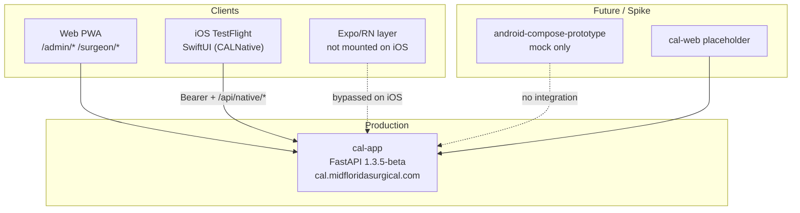

# CAL Workspace — Complete Codebase Review

**Review date:** 2026-07-01  
**Scope:** All top-level folders under `/Users/donnaile/dev/CAL`  
**Reviewer:** Automated codebase audit (Cursor agent)

---

## Executive Summary

CAL (Mid Florida Surgical Calendar) is a **multi-folder workspace** serving a surgical practice scheduling product. Production traffic runs through **`cal-app`** (FastAPI backend + Jinja2 admin/surgeon web UI) at `cal.midfloridasurgical.com`. **`cal-native`** ships an iOS TestFlight app (v1.0.1, build 12). Supporting folders (`cal-web`, `docs`, `cursor`, `android-compose-prototype`) provide policy, agent context, and exploratory UI work.

| Folder | Role | Maturity | Risk Level |
|--------|------|----------|------------|
| `cal-app` | Production backend + web UI | **Production** | Medium (auth/migration gaps) |
| `cal-native` | iOS native client (SwiftUI) + Expo/RN layer | **TestFlight** | **High** (dual-stack drift) |
| `docs` | Contracts, migration, ops runbooks | Strong | Low (doc drift) |
| `cursor` | Agent bootstrap context | Minimal | Low |
| `cal-web` | Future web lane placeholder | Stub | None |
| `android-compose-prototype` | Compose UI mock | Spike | Low (orphan) |

**Top risks across the workspace:**

1. **Dual-stack native architecture** — iOS TestFlight ships SwiftUI, but React Native has more features (push, alerts, richer mutations) that never reach production iOS users.
2. **No CI/CD** — No `.github/workflows` anywhere; tests are manual (`make test` in cal-app only).
3. **Security hardening gaps** — No rate limiting on OTP/admin login, no CSRF on admin forms, 365-day surgeon JWTs.
4. **Schema management** — Alembic listed but unused; ad-hoc `migrate_*.py` + `create_all` at startup.
5. **Documentation drift** — Duplicate server docs, stale READMEs, agent context with wrong paths.

**Top strengths:**

- Clear router → service layering in `cal-app`
- Strong native API contract tests guarding mobile compatibility
- Thoughtful OTP privacy (no email enumeration) and audit logging
- Secure token storage on both native stacks (Keychain / SecureStore)
- Solid ops documentation for production migration and contracts

---

## Workspace Architecture

```
CAL/  (no root git repo — umbrella folder)
├── cal-app/              ← Production FastAPI + web (own git repo)
│   ├── app/              112 Python modules
│   ├── tests/            21 test files
│   └── deploy/           VM cutover scripts
├── cal-native/
│   └── app/              ← Expo project (own git repo)
│       ├── src/          6 TS/TSX files (RN layer)
│       └── ios/CALNative/ 26 Swift files (production iOS UI)
├── cal-web/              README only (placeholder)
├── docs/                 5 operational docs + this review
├── cursor/               Agent context (1 file)
└── android-compose-prototype/  Compose UI mock (no git)
```



### Git Repositories

| Path | Git | Notes |
|------|-----|-------|
| `CAL/` (root) | No | Organizational umbrella only |
| `cal-app/` | Yes | Primary production codebase |
| `cal-native/app/` | Yes | Native client (nested repo) |
| `android-compose-prototype/` | No | Local spike only |

### Versioning

| Component | Version |
|-----------|---------|
| cal-app API | `1.3.5-beta.1+20260701T120527Z` |
| cal-native iOS | `1.0.1` (build 12) |
| Stack | Python 3.11, FastAPI 0.115, Expo 55, RN 0.83.6, React 19.2 |

---

## 1. cal-app — Production Backend + Web UI

**Path:** `/Users/donnaile/dev/CAL/cal-app`  
**Stack:** FastAPI, SQLAlchemy 2.0, PostgreSQL, Jinja2, Tailwind CSS  
**Status:** Active production on `192.168.5.62` (`/opt/cal`)

### Architecture

```
main.py (lifespan, middleware, router mount)
├── routers/          25 router modules (~100 endpoints)
├── *_service.py      ~25 business-logic service modules
├── native_*          Mobile API builders/serializers
├── admin_*           Admin portal services
├── rules_engine/     Scheduling conflict detection
├── models.py         Monolithic ORM (~424 lines, 20+ tables)
├── database.py       Engine + SessionLocal
├── migrate_*.py      Ad-hoc idempotent SQL migrations at startup
└── auth*.py          JWT, cookies, OTP
```

**Request flow:** Routers are thin — parse forms/query params, call `Depends(get_current_admin|get_current_surgeon)`, delegate to `*_service.py`, return HTML templates or JSON.

**Domain areas:**
- Admin scheduling (clinic, call, surgical, meetings, days off)
- Surgeon PWA (`/surgeon/*`)
- Native iOS API (`/api/native/*`)
- Calendar JSON feeds (`/api/events`, `/api/my-events`)
- OTP auth (`/api/surgeon/otp/*`)
- Wasabi S3 backup/restore
- Aprima patient schedule read-through (pymssql)

### Strengths

| Area | Detail |
|------|--------|
| Layered architecture | Clear router → service separation; routers stay small |
| Rules engine | Pluggable conflict detection (`rules_engine/registry.py`, `engine.py`) |
| Middleware | `X-App-Version` header, no-store cache for surgeon HTML and `/health` |
| OTP privacy | Responses don't enumerate valid emails/phones |
| OTP audit | IP, user-agent, delivery channel logged (`SurgeonOtpAuditLog`) |
| Native contract tests | 9 test files guard mobile API payload shapes |
| Backup design | Manifest redacts secrets; restore requires password + typing `RESTORE` |
| Docker hardening | Non-root user, healthchecks, pinned versions |
| Cookie security | `httponly`, `secure`, `samesite=lax` defaults |
| Deploy pipeline | Version bump, build, health wait, verify scripts |

### Issues

#### Critical / High

| # | Issue | Location | Impact |
|---|-------|----------|--------|
| 1 | **No rate limiting** on OTP or admin login | `routers/surgeon_otp.py`, `routers/auth.py` | Brute-force attacks on auth endpoints |
| 2 | **Destructive DB restore** available to any admin | `routers/admin_settings.py` | Any authenticated admin can wipe production DB |
| 3 | **Ad-hoc schema migrations** — Alembic unused | `main.py`, `migrate_*.py`, `requirements.txt` | Schema drift, failed deploys, race on multi-worker startup |
| 4 | **Weak OTP generation** for email path | `surgeon_otp.py` (`random.randint`) | Not cryptographically secure |
| 5 | **365-day surgeon JWT**, no server-side revocation | `auth_tokens.py`, `auth.py` | Stolen JWT works until device revoked |
| 6 | **No CSRF protection** on admin HTML forms | All admin POST routes | Cookie-only auth vulnerable to CSRF |
| 7 | **`superadmin` role never enforced** | `models.py` | All admins have equal power including restore |

#### Medium

| # | Issue | Location |
|---|-------|----------|
| 8 | `db.commit()` inside `get_current_surgeon` dependency | `auth.py` — writes `last_seen` on every request |
| 9 | Auth errors use HTTP 302 via `HTTPException` | `auth_request.py` — non-standard for API clients |
| 10 | Admin surgeon preview impersonation | `admin_surgeons.py` — any admin gets full surgeon session |
| 11 | Logo upload: extension check only, no size limit | `admin_settings_branding_service.py` |
| 12 | `PGPASSWORD` visible in docker exec argv | `wasabi_postgres.py` |
| 13 | PHI in API responses (patient names/MRN) | Aprima + surgical cases — requires TLS/nginx controls |
| 14 | No CI pipeline | Tests not run on push |

#### Low

| # | Issue |
|---|-------|
| 15 | `auth.py` thin re-export wrappers add indirection |
| 16 | Global `_settings_cache` in admin router — subtle DetachedInstance handling |
| 17 | `SurgeonDevice.token_hash` stores placeholder, not JWT hash |
| 18 | `python-jose` in maintenance mode; community prefers PyJWT |
| 19 | Broad `except Exception` in backup, push, rules engine |
| 20 | Duplicate health endpoints (`/health` and `/api/health`) |
| 21 | Service module proliferation (~6k lines across services) |

### Test Coverage

**21 test files**, all `unittest` (no pytest). Run via `make test`.

| Category | Test Files |
|----------|------------|
| Surgeon auth | `test_surgeon_auth.py`, `test_surgeon_otp_audit.py` |
| Native API contracts | `test_native_home_*` (4), `test_native_day_off_contract.py`, `test_native_call_coverage_contract.py`, `test_native_request_off_routes.py`, `test_native_misc_routes.py`, `test_native_patient_schedule.py` |
| Admin | `test_admin_calendar_events.py`, `test_admin_locations.py`, `test_admin_metrics_service.py` |
| Infrastructure | `test_wasabi_backup.py`, `test_wasabi_postgres.py`, `test_backup_jobs.py`, `test_push_cleanup.py` |
| Utilities | `test_sms_service.py`, `test_phone_formatting.py`, `test_device_names.py`, `test_version_display.py` |

**Gaps (no tests):** Admin login/logout, most admin HTML routers, rules engine, `api_calendar` endpoints, CSRF, rate limiting, end-to-end integration.

### Security Posture

| Area | Status |
|------|--------|
| Admin auth | JWT in `admin_token` cookie, bcrypt passwords |
| Surgeon auth | JWT bound to `SurgeonDevice.id`; Bearer / `X-CAL-Device-Token` / cookies |
| OTP | 6-digit code, SHA-256 hashed in `MagicLink.token_hash` |
| Secrets in git | `.env`, `cal_live.sql` gitignored; only `.env.example` tracked |
| Public endpoints | `/health`, `/api/health`, `/api/vapid-public-key`, `/admin/login`, `/surgeon/register`, OTP request/verify |

### Recommendations (cal-app)

1. Add rate limiting on OTP and admin login (slowapi or nginx `limit_req`)
2. Adopt Alembic — replace `create_all` + `migrate_*.py` with versioned migrations
3. Use `secrets.randbelow` for all OTP generation
4. Enforce role-based admin access — restrict backup/restore to `superadmin`
5. Add CSRF tokens to admin HTML forms
6. Shorten surgeon token TTL or add refresh flow
7. Remove `db.commit()` from `get_current_surgeon` — debounce `last_seen` updates
8. Add CI — `make test` on every PR
9. Expand tests — admin auth, rules engine, restore flow
10. Logo upload — max file size, content-type sniffing

---

## 2. cal-native — iOS Native Client

**Path:** `/Users/donnaile/dev/CAL/cal-native/app`  
**Stack:** Expo 55, React Native 0.83.6, SwiftUI (production iOS)  
**Status:** TestFlight 1.0.1 (build 12)

### Architecture — Dual Stack (Primary Risk)

```
cal-native/app/
├── App.tsx                    RN root (NOT iOS entry UI)
├── src/
│   ├── config/env.ts          API base URL (dev/prod)
│   ├── auth/tokenStore.ts     expo-secure-store
│   ├── services/calApi.ts     RN HTTP client
│   ├── types/cal.ts           Domain types
│   └── features/
│       ├── auth/AuthScreen.tsx
│       └── schedule/ScheduleScreen.tsx  (3,645 lines!)
└── ios/CALNative/             ← PRODUCTION iOS UI (26 Swift files)
    ├── AppDelegate.swift      Launches CALNativeRootView, not RN
    ├── CALNativeRootView.swift
    ├── NativeScheduleStore.swift
    ├── NativeCALClient.swift
    └── CALKeychain.swift
```

**Critical finding:** `AppDelegate.swift` sets `UIHostingController(rootView: CALNativeRootView())` as the window root. React Native is initialized but **not mounted as visible UI**. TestFlight users get SwiftUI, not React Native.

### Strengths

| Area | Detail |
|------|--------|
| Folder layout | Sensible `src/config`, `src/auth`, `src/services`, `src/features` |
| TypeScript | `strict: true`; thorough domain types in `cal.ts` |
| Token storage | RN: `expo-secure-store`; Swift: Keychain with `kSecAttrAccessibleWhenUnlockedThisDeviceOnly` |
| API client (RN) | Central `apiCall<T>()` with 401 handling and session-expiry callback |
| Release URL lock | `env.ts` only allows `EXPO_PUBLIC_CAL_API_BASE_URL` override in `__DEV__` |
| EAS pipeline | Simulator, TestFlight, Android APK profiles configured |
| Swift UI structure | Store/actions/client/loader split; session expiry handled |

### Issues

#### Critical

| # | Issue | Detail |
|---|-------|--------|
| 1 | **Dual-stack drift** | RN is not what iOS ships; RN features don't reach TestFlight users |
| 2 | **No automated tests** | Zero test files; no Jest config; high risk for medical scheduling app with PHI |

#### High

| # | Issue | Detail |
|---|-------|--------|
| 3 | **Feature parity gap (Swift < RN)** | Swift lacks: push registration, alerts, personal day-item CRUD, time-off update/cancel |
| 4 | **Push not on production iOS** | RN has push; Swift never calls `/api/native/push-token`; no `NSUserNotificationsUsageDescription` |
| 5 | **RN logout dead code** | `onLogout()` in `App.tsx` never passed to `ScheduleScreen` |
| 6 | **3,645-line monolith** | `ScheduleScreen.tsx` — 40+ inline components in one file |
| 7 | **Stale README** | Claims `/api/my-events`; actual code uses `/api/native/home` |

#### Medium

| # | Issue |
|---|-------|
| 8 | Duplicated API clients (`calApi.ts` + `NativeCALClient.swift`) |
| 9 | Inconsistent API path prefixes (`/api/native/*` vs `/surgeon/api/day-items`) |
| 10 | `deleteDayItem` bypasses central `apiCall` helper |
| 11 | Dead API exports (`fetchMyEvents`, `saveSurgeryNotes`) |
| 12 | God component `App.tsx` (~420 lines) |
| 13 | New Architecture mismatch (`Podfile.properties.json` vs `Info.plist`) |
| 14 | No ESLint, Prettier, or `typecheck` script |
| 15 | No CI |
| 16 | Android folder missing despite `eas.json` android-apk profile |
| 17 | Build artifacts on disk (`app/build/`) |

#### Low

| # | Issue |
|---|-------|
| 18 | Keychain service name `app:no-auth` — odd naming |
| 19 | `NSFaceIDUsageDescription` without `LocalAuthentication` usage |
| 20 | Unsafe JSON cast in `calApi.ts` |
| 21 | Error messages leak API URLs to users |
| 22 | PHI on screen with no screenshot/blur protection |

### Feature Parity Matrix

| Feature | RN (`calApi.ts`) | Swift (`NativeCALClient`) | Ships on iOS |
|---------|------------------|---------------------------|--------------|
| OTP auth | Yes | Yes | Yes |
| Native home | Yes | Yes | Yes |
| Schedule view | Yes | Yes | Yes |
| Time-off request | Yes | Yes | Yes |
| Time-off update/cancel | Yes | **No** | **No** |
| Day-item CRUD | Yes | **No** | **No** |
| Push notifications | Yes | **No** | **No** |
| Alerts read/mark | Yes | **No** | **No** |
| Patient schedule | Yes | Yes | Yes |
| Call coverage | Yes | Yes | Yes |
| Logout UI | Dead code | Yes | Yes (Swift only) |

### Recommendations (cal-native)

1. **Pick a single iOS UI strategy** — commit to SwiftUI (current production) or revert to RN root
2. **Close Swift feature gaps** — port push, alerts, day-item CRUD, time-off mutations from RN
3. **Consolidate API layer** — OpenAPI-generated client or shared contract doc
4. **Refactor RN** (if keeping for Android) — split `ScheduleScreen.tsx`, extract hooks from `App.tsx`
5. **Add engineering hygiene** — typecheck, ESLint, Jest tests, CI workflow
6. **Update README** — reflect SwiftUI iOS entry, correct endpoints
7. **Document PHI/compliance** — session timeout, device encryption, screenshot policy

---

## 3. docs — Operational Documentation

**Path:** `/Users/donnaile/dev/CAL/docs`  
**Files:** 5 operational docs + this review

| File | Purpose | Quality |
|------|---------|---------|
| `cal-contract-inventory.md` | Locked API/auth/env contracts | **Excellent** |
| `MFSA_SERVER_SET_MASTER.md` | Full server map (edge, CAL, RVU, SSS) | **Strong** |
| `cal-prod-5.62-migration.md` | Legacy → .62 VM migration runbook | **Strong** (real parity data) |
| `cal-mac-dev-svp-readiness.md` | Mac dev bootstrap runbook | **Good** |
| `cal-web-native-separation-policy.md` | Web-first guardrails | **Good** |

### Strengths

- Contract inventory is comprehensive: frozen route namespaces, JWT/cookie semantics, env key inventory
- Migration docs include real row-count parity and explicit warnings
- Web/native separation policy gives clear non-negotiable guardrails

### Issues

| Severity | Issue |
|----------|-------|
| Medium | `MFSA_SERVER_SET_MASTER.md` duplicated in `cal-app/docs/` with slightly different content |
| Medium | No native architecture doc (SwiftUI vs RN, TestFlight status, Android prototype) |
| Low | No `docs/README.md` index explaining doc precedence |
| Low | `cursor/CURSOR_CONTEXT.md` paths omit `cal-app/` prefix |

### Recommendations

1. Designate `docs/` as canonical; deduplicate `MFSA_SERVER_SET_MASTER.md`
2. Add `docs/cal-native-architecture.md`
3. Add `docs/README.md` with doc hierarchy
4. Update `cursor/CURSOR_CONTEXT.md` paths

---

## 4. cursor — Agent Bootstrap Context

**Path:** `/Users/donnaile/dev/CAL/cursor`  
**Files:** `CURSOR_CONTEXT.md` (31 lines)

### Purpose

Single pointer file telling Cursor agents which docs and source files matter.

### Issues

| Severity | Issue |
|----------|-------|
| Medium | Relative paths (`app/main.py`) assume wrong cwd — agents opening from `CAL/` root miss files |
| Medium | Missing native files (`native_api.py`, `cal-native` entrypoints) |
| Low | No testing guidance or git repo notes |

### Recommendations

1. Prefix all paths with `cal-app/`
2. Add native track section
3. Note `cal-app` is the only git repo at workspace level

---

## 5. cal-web — Web Lane Placeholder

**Path:** `/Users/donnaile/dev/CAL/cal-web`  
**Files:** `README.md` (9 lines)

### Purpose

Explicit web track marker per separation policy. Runtime lives in `cal-app`.

### Assessment

**~5% complete** — organizational stub, not a deliverable codebase. No risk, but name may confuse newcomers.

### Recommendations

1. Add links to policy docs and bootstrap scripts in README
2. Define migration checklist when/if web assets split from `cal-app`

---

## 6. android-compose-prototype — Compose UI Mock

**Path:** `/Users/donnaile/dev/CAL/android-compose-prototype`  
**Stack:** Jetpack Compose, Material 3, Kotlin 2.1, compileSdk 36  
**Status:** UI prototype only — no backend integration

### Structure

```
android-compose-prototype/
├── app/src/main/java/.../MainActivity.kt  (461 lines, all UI)
└── app/build/                             (~285 artifact files on disk)
```

### Strengths

- Modern Compose stack with CAL teal branding
- Polished mock UI: Today dashboard, schedule, messages, time off, profile tabs
- Builds successfully (debug APK present)

### Issues

| Severity | Issue |
|----------|-------|
| Critical | Zero backend integration — hardcoded mock data only |
| High | Build artifacts on disk with no `.gitignore` |
| High | No documentation — purpose and status undocumented |
| Medium | Monolithic architecture — entire app in one `MainActivity.kt` |
| Medium | Orphan spike — not referenced in docs, cursor, or cal-native |
| Low | Package name differs from shipping `com.midfloridasurgical.calnative` |

### Recommendations

1. Add `README.md` — "UI prototype only; does not call cal-app"
2. Add `.gitignore` excluding `app/build/`, `.gradle/`
3. Decide: merge into cal-native Android path, archive, or continue as design reference

---

## Cross-Cutting Findings

### No CI/CD Anywhere

No `.github/workflows` found in any folder. All testing is manual:
- `cal-app`: `make test` (21 unittest files)
- `cal-native`: no tests
- `android-compose-prototype`: no tests

### Sensitive Files (Local Disk, Not in Git)

| File | Status |
|------|--------|
| `cal-app/.env`, `.env.mac-dev` | Gitignored, present on disk |
| `cal-app/cal_live.sql`, `cal_live.dump` | Gitignored, present on disk |
| `cal-native/app/.env` | Gitignored |
| `cal-app/.env.example` | Tracked — placeholder secrets only |

### PHI Handling

Patient names, MRNs, and DOBs flow through:
- `cal-app` Aprima integration and surgical case models
- `cal-native` Patients tab (both Swift and RN)
- No screenshot protection, certificate pinning, or runtime blur observed

Ensure TLS termination, access controls, and HIPAA policies are documented and enforced at the nginx/infrastructure layer.

### Web-First Policy Status

Per `cal-web-native-separation-policy.md`:
- Web remains primary until explicit cutover sign-off
- Native cutover criteria defined but not yet met (push, full feature parity, incident runbook)
- All native API changes must be additive and backward-compatible

---

## Priority Action Items

### P0 — Address Before Native Cutover

| # | Action | Owner Area |
|---|--------|------------|
| 1 | Resolve dual-stack architecture — pick SwiftUI or RN for iOS | cal-native |
| 2 | Port push notifications to Swift iOS | cal-native |
| 3 | Add rate limiting on OTP and admin login | cal-app |
| 4 | Adopt Alembic for schema migrations | cal-app |

### P1 — Security & Reliability

| # | Action | Owner Area |
|---|--------|------------|
| 5 | Add CSRF protection to admin forms | cal-app |
| 6 | Enforce `superadmin` role for destructive operations | cal-app |
| 7 | Shorten surgeon JWT TTL | cal-app |
| 8 | Add CI pipeline (`make test` on PR) | cal-app |
| 9 | Close Swift/RN feature parity gaps | cal-native |

### P2 — Engineering Hygiene

| # | Action | Owner Area |
|---|--------|------------|
| 10 | Deduplicate `MFSA_SERVER_SET_MASTER.md` | docs |
| 11 | Add `docs/cal-native-architecture.md` | docs |
| 12 | Fix `cursor/CURSOR_CONTEXT.md` paths | cursor |
| 13 | Refactor `ScheduleScreen.tsx` monolith | cal-native |
| 14 | Add README + `.gitignore` to android prototype | android-compose-prototype |
| 15 | Add native client tests (at minimum `calApi.ts`) | cal-native |

---

## Appendix: Key File Reference

### cal-app

| Concern | Path |
|---------|------|
| App entry | `cal-app/app/main.py` |
| Auth | `cal-app/app/auth.py`, `auth_tokens.py` |
| OTP | `cal-app/app/routers/surgeon_otp.py` |
| Models | `cal-app/app/models.py` |
| Native API | `cal-app/app/routers/native_api.py` |
| Backup | `cal-app/app/wasabi_backup.py` |
| Tests | `cal-app/tests/` |
| Deploy | `cal-app/Dockerfile`, `Makefile` |

### cal-native

| Concern | Path |
|---------|------|
| RN app shell | `cal-native/app/App.tsx` |
| RN API client | `cal-native/app/src/services/calApi.ts` |
| RN token store | `cal-native/app/src/auth/tokenStore.ts` |
| iOS launch | `cal-native/app/ios/CALNative/AppDelegate.swift` |
| Swift state | `cal-native/app/ios/CALNative/NativeScheduleStore.swift` |
| Swift API client | `cal-native/app/ios/CALNative/NativeCALClient.swift` |
| EAS config | `cal-native/app/eas.json` |

### docs & guidance

| Concern | Path |
|---------|------|
| API contracts | `docs/cal-contract-inventory.md` |
| Server topology | `docs/MFSA_SERVER_SET_MASTER.md` |
| Web/native policy | `docs/cal-web-native-separation-policy.md` |
| Agent context | `cursor/CURSOR_CONTEXT.md` |

---

*End of review. For questions or follow-up deep-dives (e.g., native API parity matrix, security audit), reference this document and specify the area of interest.*
